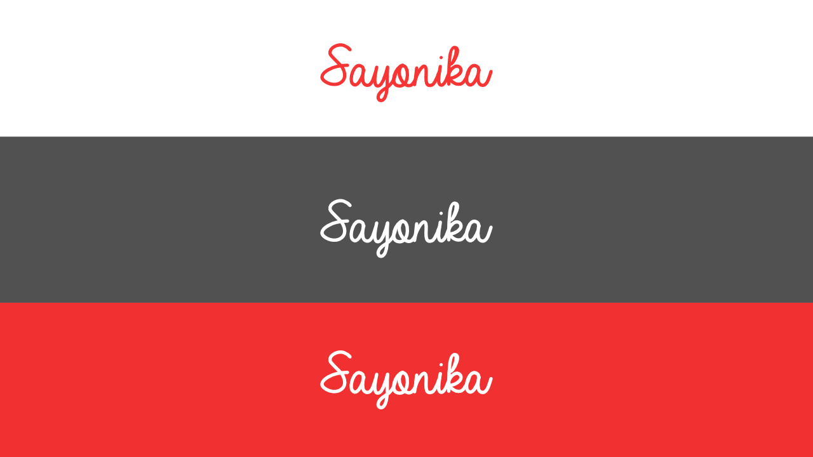
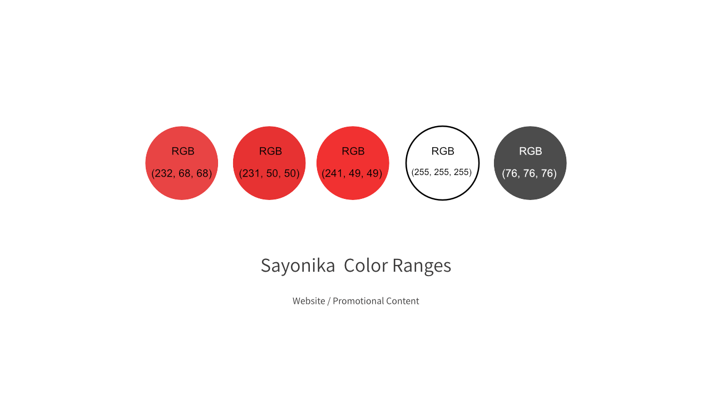
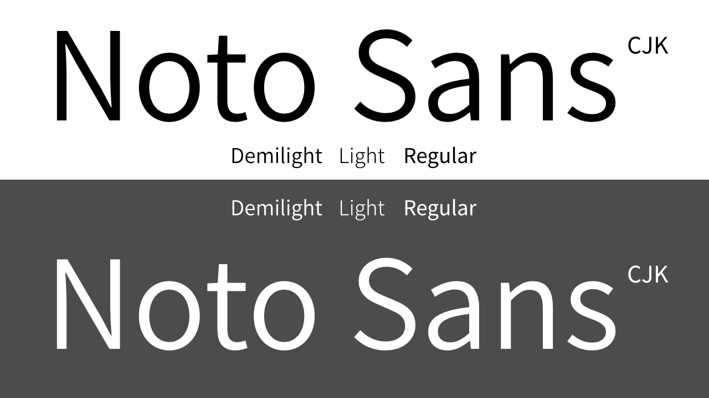
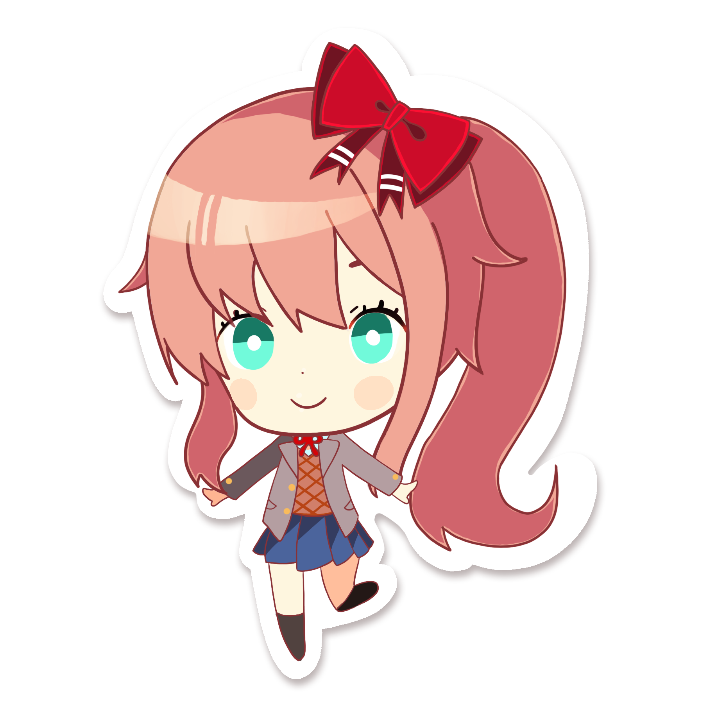

# The Sayonika Press Kit
The Sayonika Press Kit, maintained by @sr229 and Cyrke.

## About the Press Kit

The press kit's aim is for you to use the standard colour ranges, usages of the logo, and Mascot assets optimally. 
These were created to familiarise you on the acceptable color range we use on our website designs and promotional content.

## Disclaimer

Doki Doki: Literature Club!, logo, and artworks are Copyright Team Salvato. All Rights Reserved.

Noto Sans CJK is a font by Google Inc. Released under the SIL Open Font License.

Sayonika Mascot design, VN Sprites, Sayonika Logo, and the Font face is licensed under Creative Commons 3.0 Non-Commercial-Unported under:

- The Sayonika Project Authors
  - [@sr229 (enra@headbow.stream)](https://github.com/sr229)
  - [@Ovyerus (iamovyerus@gmail.com)](https://github.com/Ovyerus)
- [Cyrke](https://reddit.com/u/Cyrke_)

If you have any questions, please contact the following persons.

## Logo

Logo uses [Coffee & Tea](https://www.dafont.com/coffe-tea.font), and only comes with the red and white versions.

## Colour pallettes

These are the prescribed color ranges we use on Sayonika.
We use three shades of red accordingly, depending on the use case.

## Font

We exclusively use [Noto Sans CJK](https://www.google.com/get/noto/help/cjk/) for our fonts.

We only use the following in our content:

- Demilight
- Light
- Regular

## Mascot

The Sayonika mascot is a mixture of Monika and Sayori, with a blue-green eye pallette and a combination of Sayori's hair color with Monika's hair style. The ribbon is red with white stripes on the ends.

You can find the full set of the  mascot sprites for VN usage or whatever purpose in `mascot/`.

