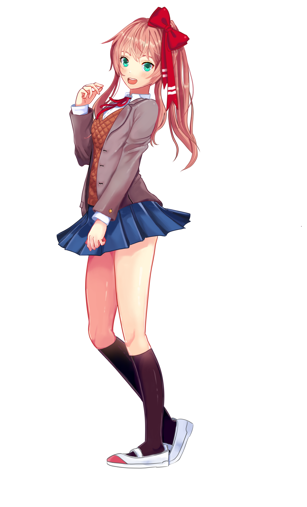

# The Sayonika Press Kit
The Sayonika Press Kit, maintained by @sr229 with Cyrke.

## About the Press Kit

The press kit's aim is for you to use the standard colour ranges, usages of the logo, and Mascot assets optimally. 
These were created to familiarise you on the acceptable color range we use on our website designs and promotional content.

## Logo

Logo uses [Always in my Heart](https://www.dafont.com/always-in-my-heart.font), and only comes with the red and white versions.

## Colour pallettes

These are the prescribed color ranges we use on Sayonika.
We use three shades of red accordingly, depending on the use case.

## Font

We exclusively use [Noto Sans CJK](https://www.google.com/get/noto/help/cjk/) for our fonts.

We only use the following in our content:

- Demilight
- Light
- Regular

## Mascot

The Sayonika mascot is a mixture of Monika and Sayori, with a blue-green eye pallette and a combination of Sayori's hair color with Monika's hair style. The ribbon is red with white stripes on the ends.

This mascot and its two more variants is free for you to use under Creative Commons 3.0 Non Commercial.

